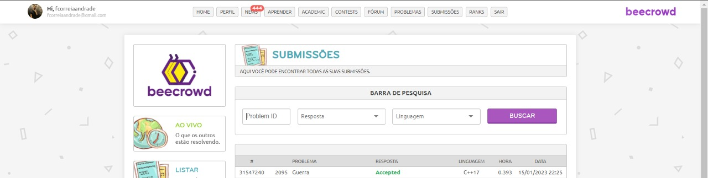
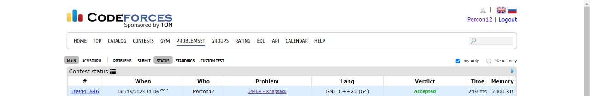

# Greed_Dupla19_Questoes-Resolvidas

**Número da Lista**: 4 
**Conteúdo da Disciplina**: Greed 

## Alunos
|Matrícula | Aluno |
| -- | -- |
| 18/0113259  |  Felipe Correia Andrade |
| 18/0127535  |  Mateus Brandão Teixeira |

## Sobre 
Resolução dos exercicíos (BeeCrowd e CodeForce) do conteudo de algoritmos ambiciosos ou "Greed"

## Screenshots
1- [Broken Keyboard](https://codeforces.com/problemset/problem/1765/B)

2- [War](https://www.beecrowd.com.br/judge/en/problems/view/2095)

3- [Knapsack](https://codeforces.com/problemset/problem/1446/A)

## Instalação 
**Linguagem**: C++ e Python3 

